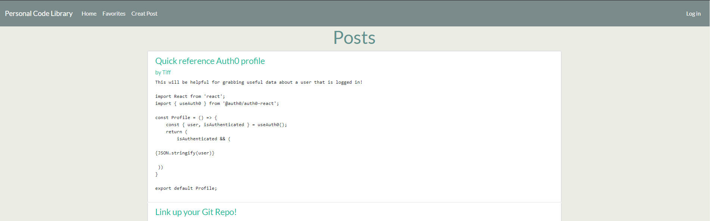
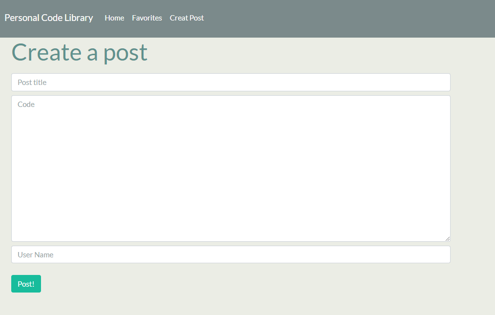
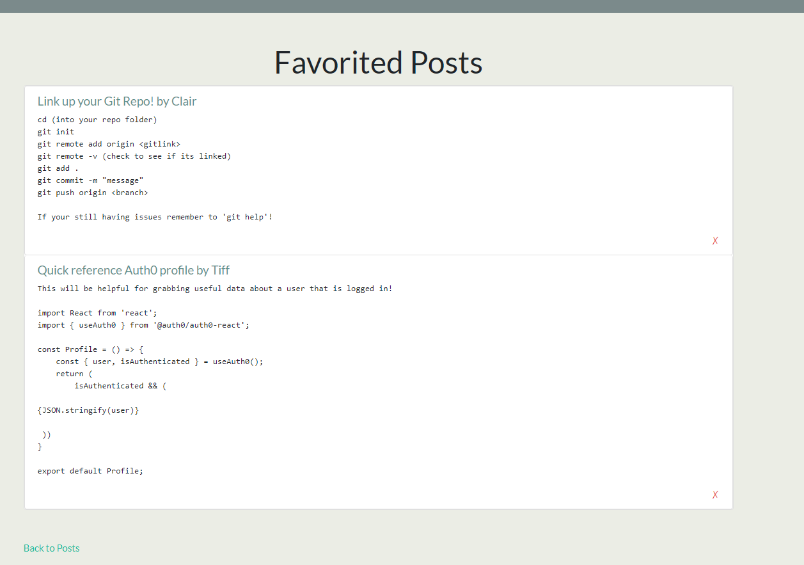

## Description ## 

A personal library for users to log in to their personal account and have access to resource and users posts in a forum or dashboard format. 
The user can also search the database for post Titles, Tags or Users to help navigate around the web app. Users can also give likes and dislikes 
to other users code to assist in sorting the most useful information.

## Images ##

## Installation ##

Run the npm init & npm install commands in the command line before use. You then need to npm install auth0, axios, mongoose & express
 
## Usage ##

Version deployed to Heroku.
[Deployed Application](https://personalcodelibrary.herokuapp.com/)
